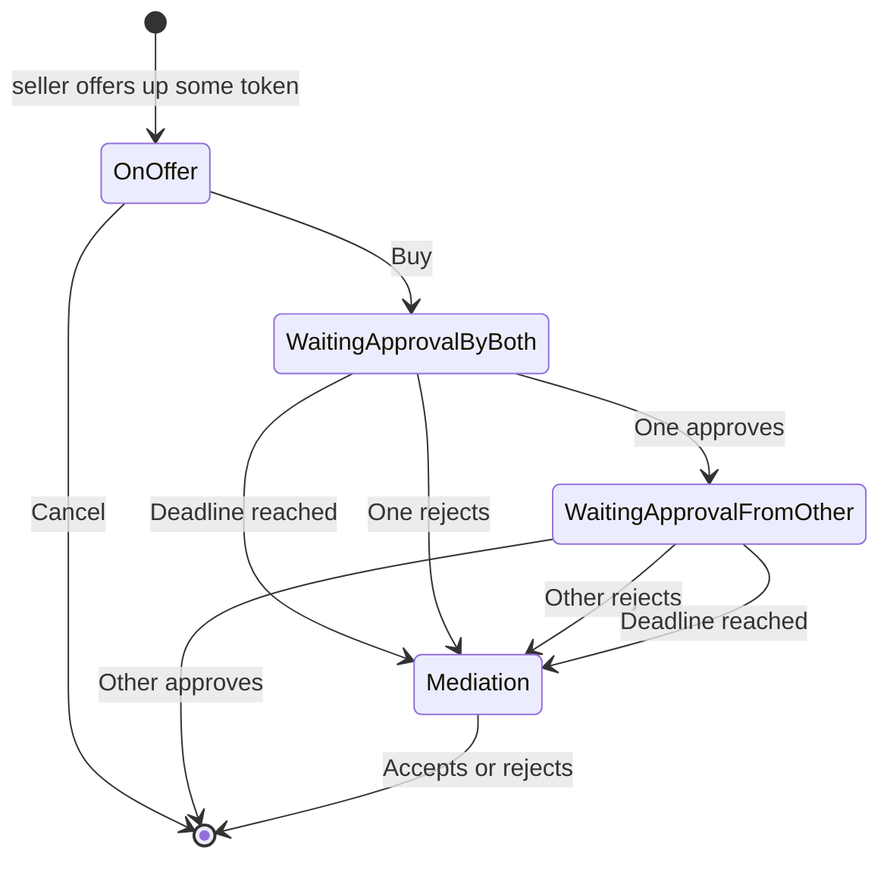

An escrow smart contract system with the following features:

1. A party can place tokens in escrow for a swap. They can cancel and reclaim their assets.
2. If their swap is accepted by another party, their tokens are locked until the following conditions are met:

  a. Both parties issue an “approve” transaction.
  b. The deadline for acceptance expires.
  c. One party approves and one party rejects the swap.

3. If one party approves the swap and the other rejects the swap, or the deadline is reached, the tokens are placed in a mediation state. In this state the mediator can decide whether the swap should be accepted or rejected.

This escrow system has an offline portion. Someone places tokens in the contract and someone else agrees to accept the swap. The swap doesn't happen until an offline delivery occurs. Then both users have to agree the offline part was successful. Then the swap happens. If there is a disagreement, a specific pkh, the mediator, can make a decision, and the swap happens.



## Creating the Script Address

After compiling the smart contract, it is necessary to make a script address.

First source either the testnet or mainnet environment variables.

For testnet

```
$ source scripts/envars/testnet-env.envars
```

For mainnet

```
$ source scripts/envars/mainnet-env.envars
```

The environment variable files set `CARDANO_NODE_SOCKET_PATH` to the path of the appropriate Daedalus socket file (either Testnet Daedalus or the regular mainnet Daedalus). It you run a `cardano-node` on your own you should set this environment variable to your socket file location after sourcing the environment variable file.

First create the wallets and get the protocol parameters.

```
$ ./scripts/wallets/make-all-wallets.sh
$ ./scripts/query-protocol-parameters.sh
```

Next, run:

```bash
scripts/compile.sh
```

This will make the files `scripts/testnet/escrow.addr` or `scripts/mainnet/escrow.addr`.

## Example Transactions

The folder `scripts/core` has parameterized example transactions. These are used by the wrappers in `scripts/happy-path` and `scripts/failure-cases`. The various transactions are combined in test scripts in the folder `scripts/tests`.

## Running the Tests

To run the tests run `scripts/tests/all.sh`
